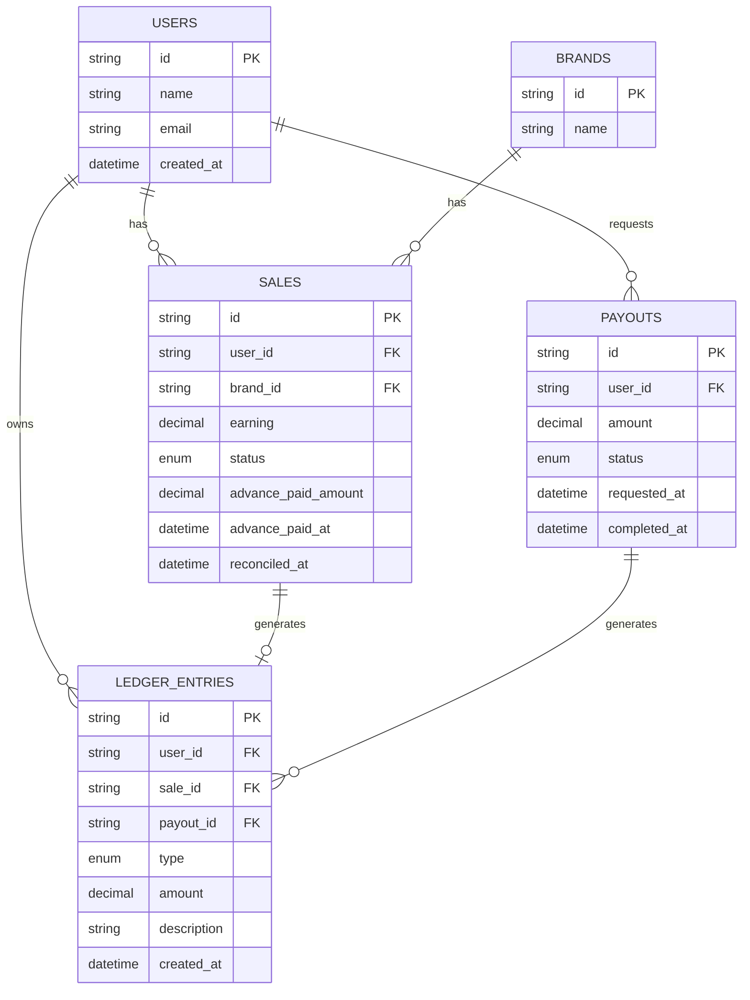

# Low Level Design - User Payout Management System 

## 1. Overview 

This system manages sale payouts through 3 stages: 
1. a sale enters as `pending`.
2. an advance payout `(10% of earning)` is sent
3. an admin reconciles the sale to `approved` or `rejected`, triggering a final adjustment that accounts for the advance alreadt paid. 

Users can withdraw their balance once every 24 hours. Failed, cancelled, rejected withdrawals are automatically credited back.

## 2. Core Design : Append Only Ledger 

User has no balance column. Instead, every money event is written as its own immutable row in a `LedgerEntry` table and a users balance is derived by summing their entries.

`The reason i chose not to make a mutable balance is:`

1. **No audit** We cant explain the reason behind users balance because there is no audit.
2. **Idempotency becomes trivial** "Has this sale already been advanced?" is
  answered by checking `Sale.advance_paid_at IS NULL`, not by trusting a
  counter was incremented exactly once.
3. **Reversals are just another row** Crediting back a failed payout is
  "insert a `REVERSAL_CREDIT` row," not "carefully subtract a subtraction."
4. **Race safety.** Summing rows avoids the classic read-modify-write race
  condition inherent to `balance += x`.

## 3. ER Diagram
# Entity-Relationship Diagram

## 4. Schema

| Table | Key columns | Notes |
|---|---|---|
| `users` | id (UUID), name, email (unique) | |
| `brands` | id (UUID), name (unique) | |
| `sales` | id, user_id (FK), brand_id (FK), earning (Numeric), status (enum), advance_paid_amount, advance_paid_at, reconciled_at | `advance_paid_at IS NULL` is the idempotency guard for the advance job |
| `ledger_entries` | id, user_id (FK), sale_id (FK, nullable), payout_id (FK, nullable), type (enum), amount (signed Numeric), created_at | Append-only; never updated or deleted |
| `payouts` | id, user_id (FK), amount, status (enum), requested_at, completed_at | Represents a withdrawal attempt sent to a processor |

All money fields use `Numeric(12,2)` and Python `Decimal` — never `float` —
to avoid binary floating-point rounding errors in financial calculations.

Indexes: `sales(user_id, status)`, `ledger_entries(user_id, created_at)`,
`payouts(user_id, requested_at)` — all support the query patterns actually
used by the services (advance job scan, balance sum, cooldown lookup).

## 5. Business Rule Implementation

### 5.1 Advance Payout (idempotency)
`AdvancePayoutService.run_batch()` selects sales where
`status == pending AND advance_paid_at IS NULL`. Each payment commits
individually (not batched into one final commit), so a mid-batch crash
leaves already-paid sales correctly marked and safely re-runnable — the
job can be triggered any number of times without double-paying.
Verified by `test_advance_payout_service.py`.

### 5.2 Reconciliation
`ReconciliationService.reconcile()` computes: 
final_entitlement = earning if `approved` 
final_entitlement = 0 if `rejected` 
adjustment = final_entitlement - advance_already_paid

A guard (`SaleAlreadyReconciledError`) prevents reconciling a sale twice.
A sale reconciled without ever receiving an advance is handled correctly
via `advance_paid_amount or Decimal("0.00")`.

### 5.3 Withdrawal Cooldown
Only `Payout` rows with status `initiated` or `completed` count toward the
24-hour cooldown. A payout that later moves to `failed`/`cancelled`/
`rejected` stops counting — this is what allows Question 2's "user can
withdraw again" requirement to actually work, since a failed withdrawal
would otherwise unfairly lock the user out for 24 hours through no fault
of their own. This is a deliberate interpretation, not explicit in the
spec, chosen because the alternative directly undermines Question 2.

### 5.4 Failed Payout Recovery
`PayoutRecoveryService.mark_payout_failed()` transitions a payout from
`initiated` to a terminal failure state and inserts a `REVERSAL_CREDIT`
ledger row equal to the original debited amount — restoring the balance
without ever mutating the original entry. A guard prevents reversing an
already-resolved payout twice.

## 6. Failure Scenarios Considered

| Scenario | Handling |
|---|---|
| Advance job run twice on same sale set | Blocked by `advance_paid_at IS NULL` filter |
| Reconciling an already-reconciled sale | `SaleAlreadyReconciledError` |
| Reconciling a sale that never got an advance | Falls back to `Decimal("0.00")`, works correctly |
| Withdrawal exceeding balance | `InsufficientBalanceError` → HTTP 400 |
| Withdrawal within 24h of last one | `WithdrawalTooSoonError` → HTTP 429 |
| Payout fails after debit | `REVERSAL_CREDIT` restores balance; failed payout excluded from cooldown |
| Reversing an already-resolved payout twice | `InvalidPayoutStateError` |
| SQLite naive/aware datetime mismatch | `_ensure_aware()` helper normalizes to UTC before arithmetic |

## 7. Trade off 

I used SQLite because it requires no setup and is easy to implement. It can be swapped to Postgres by just changing one var in env `DATABASE_URL`. I haven't used in SQLite specific function in the code so that it is easily swappable with Postgres
